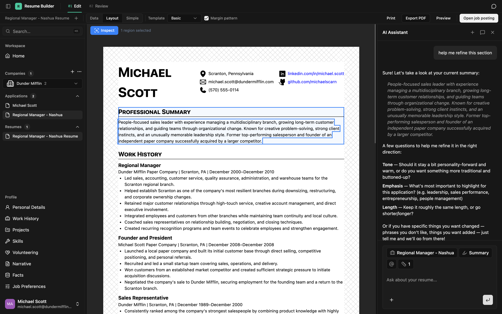
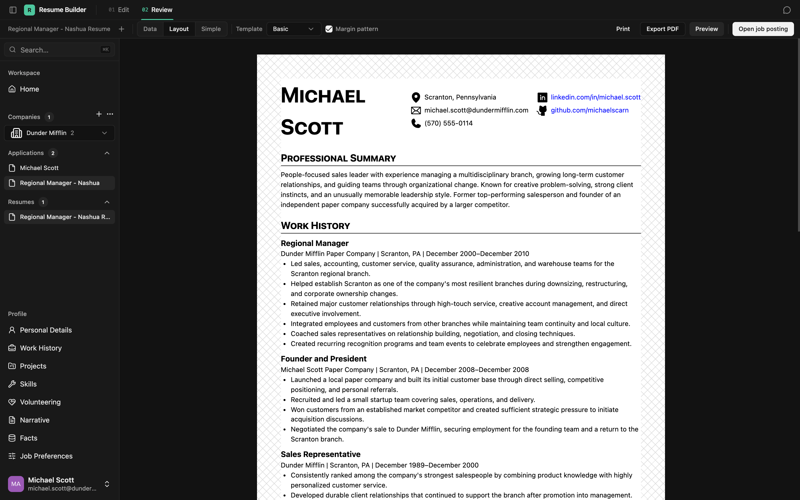
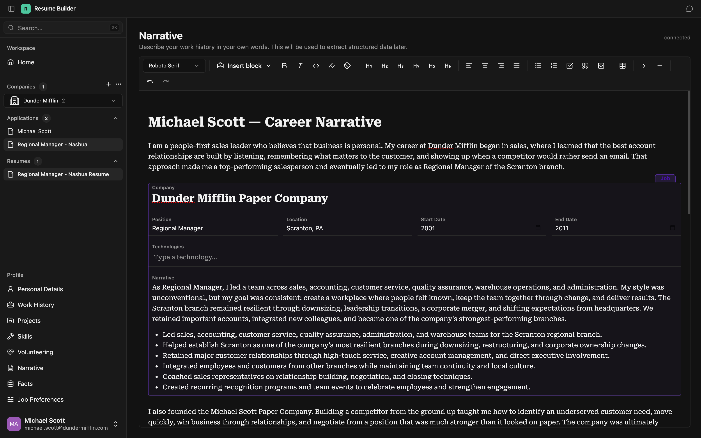
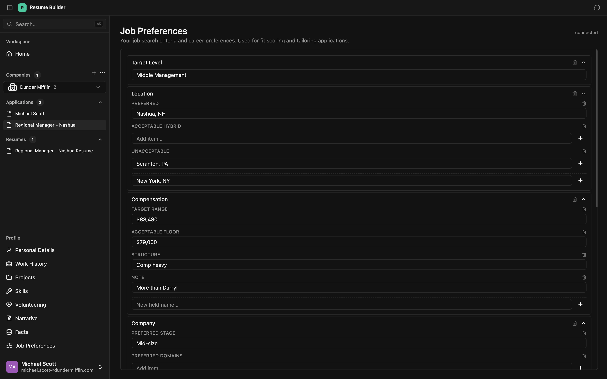
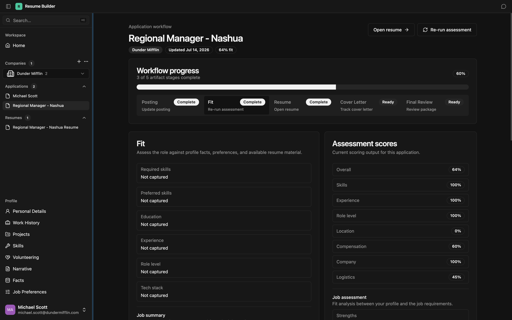
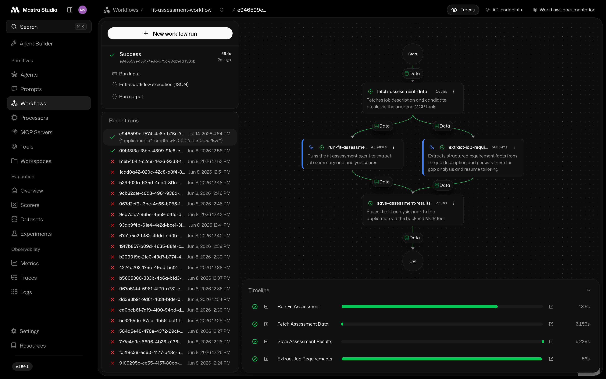

# Resume Builder

**A career workspace for turning one reusable professional profile into a
focused application for every role.**

Resume Builder brings the context around a job search into one place: career
history, projects, skills, job preferences, postings, fit assessments, and the
resume tailored for each opportunity. Instead of rebuilding the same document
for every application, you maintain a source of truth and shape it for the role
in front of you.

<p align="center">
  
</p>

## What it does

- **Keeps a reusable career profile.** Capture work history, education,
  projects, skills, volunteering, preferences, and the longer-form narrative
  behind your experience.
- **Organizes the search by application.** Save the company, role, posting,
  notes, analysis, and related resume as one workspace.
- **Assesses fit with context.** Compare a posting with your experience and job
  preferences to surface strengths, gaps, and practical considerations.
- **Builds role-specific resumes.** Start fresh or clone a base resume, choose
  the most relevant material, edit it inline, and reorder sections without
  changing the underlying profile.
- **Works alongside an AI assistant.** Application-aware conversations can use
  the selected role and career context, including making changes to the live
  resume document.
- **Stays in sync.** Resume and profile documents use a real-time collaborative
  editing model with shared undo and redo.
- **Produces a finished artifact.** Review the resume in multiple layouts,
  preview it separately, print it, or export it as a PDF.

## The workflow

1. **Build your profile** — record the experience and preferences you want to
   draw from across your search.
2. **Add an opportunity** — create an application from a role, company, and job
   posting.
3. **Understand the match** — extract the important parts of the posting and
   assess them against your background.
4. **Tailor the resume** — create or clone a resume, refine the content, and
   choose a layout for the role.
5. **Review and export** — check the complete application package and generate
   a shareable PDF.

<p align="center">
  
</p>

## Product principles

### Profile first, document second

A resume is one view of a career, not the career itself. The profile preserves
the richer source material—facts, stories, preferences, and accomplishments—so
each resume can be selective without losing context.

<p align="center">
  
</p>

Preferences are part of that source material too. Target level, location,
compensation, company, and working-style constraints can be recorded once and
used when evaluating every opportunity.

<p align="center">
  
</p>

### Applications are workspaces

The posting, fit analysis, conversations, and tailored resume stay connected.
That makes it easier to return to an opportunity and understand both the role
and the decisions behind the document.

<p align="center">
  
</p>

### AI should work in context

The assistant is connected to the same application and resume data shown in
the editor. AI-generated analysis and edits remain inspectable, editable, and
part of the normal workflow.

## Mastra integration

The [`@resume-builder/orchestration`](packages/orchestration) service uses
[Mastra](https://mastra.ai/) to separate open-ended agent behavior from
repeatable application workflows. Agents provide focused capabilities such as
fit assessment, job-requirement extraction, background autofill, application
review, interview coaching, and contextual chat. Workflows compose those
capabilities into durable, inspectable processes.

The fit-assessment workflow is a representative example:

1. Fetch the application, career profile, and job preferences through the
   backend's authenticated MCP tools.
2. Run the fit assessment and extract structured job requirements in parallel.
3. Validate the structured output and save the analysis back to the
   application through MCP.

The chat agent uses thread-scoped memory and receives the active application,
resume, and selected editor regions as request context. The backend remains the
system of record: Mastra agents read and write domain data through the same MCP
boundary instead of connecting directly to application tables.

Mastra Studio makes workflow runs, step timing, traces, and failures visible
during development. Application state is persisted in PostgreSQL, while local
observability data is stored separately and filtered for sensitive values.

<p align="center">
  
</p>

## Under the hood

Resume Builder is an Nx monorepo with five main packages:

| Package                                                   | Role                                                    |
| --------------------------------------------------------- | ------------------------------------------------------- |
| [`@resume-builder/web`](packages/resume-builder)          | React application and resume editor                     |
| [`@resume-builder/backend`](packages/backend)             | GraphQL API, persistence, authentication, and MCP tools |
| [`@resume-builder/crdt`](packages/crdt)                   | Hocuspocus server for collaborative Yjs documents       |
| [`@resume-builder/orchestration`](packages/orchestration) | Mastra agents and workflows for analysis and assistance |
| [`@resume-builder/entities`](packages/entities)           | Shared models, schemas, and domain types                |

The frontend uses React 19, TanStack Router, MobX, shadcn/ui, Tiptap, and Yjs.
The backend is built with NestJS, GraphQL, Prisma, and PostgreSQL. Mastra and the
Model Context Protocol connect AI workflows to the application's domain data.

<details>
<summary><strong>Local development</strong></summary>

### Prerequisites

- Node.js 24.8.0 (see [`.nvmrc`](.nvmrc))
- npm
- Docker
- Local authentication and AI provider configuration

### Install and run

```sh
npm install
npm start
```

`npm start` brings up the local data services and runs the entities, backend,
CRDT, and web projects through Nx. The repository also supports standard Nx
commands for working with an individual project:

```sh
nx run <project>:<target>
nx affected -t <target>
nx run-many -t <target>
```

Useful workspace checks:

```sh
npm run lint
npm run format:check
```

</details>

## Status

This is an actively developed personal project. The core profile, application,
assessment, collaborative editing, and PDF workflows are implemented; some
parts of the broader application workflow are still evolving.

## License

Licensed under the [Business Source License 1.1](LICENSE).
